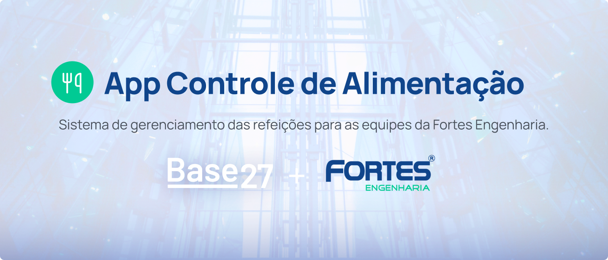

# Controle de Alimentação App | Projeto Base Científica + Fortes Engenharia

##   



## 💻 Sobre o projeto

Sistema desenvolvido para o gerenciamento do consumo de refeições servidas as equipes nas obras pela empresa Fortes Engenharia. O serviço busca simplificar o gerenciamento do programa de alimentação com o objetivo de aumentar a sua acertividade, resultando na diminuição de custos e geração de relatórios.
A solução proposta é escalável e pode ser adaptada para atender a diferentes necessidades de obras e projetos com o objetivo de obter uma melhor gestão dos recursos e uma relação mais transparente e justa com os fornecedores.

#### [Base27 | Programa Base Científica](https://base27.com.br/)

A Base Científica, é um programa idealizado pela diretoria de educação do Base27 que se propõe a favorecer o desenvolvimento de soluções das dores das empresas por alunos de instituições parceiras, privilegiando uma formação mais inovadora a partir da conexão entre instituições de ensino e empresas mantenedoras.

#### [Desafio Fortes Engenharia](https://sites.google.com/base27.com.br/baseeducacao/projetos/base-cient%C3%ADfica)

> Atualmente, o processo de controle de refeições é ineficiente, resultando em pagamentos baseados em programação e não no consumo real. A proposta visa a implementação de um aplicativo para gerenciamento de refeições, garantindo precisão no controle para análise de dados.

---

## 💿 Demo

`Colocar Demostração`

## 🔗 Links do Projeto

| Deploy                                                      | Projeto                     |
| :---------------------------------------------------------- | :-------------------------- |
| [🔗](https://www.figma.com/community/file/1421570851107580734/app-gerenciamento-de-refeicoes)                        | `Figma Design de Interface` |
| [🔗](https://github.com/jacinoberto/fortes-alimentacao-api) | `Back-End API`              |
| [🔗](https://github.com/Flickler/FortesAdministracao)       | `Front-End Angular`         |

## 📐 Design

`Diagramas UML
Modelo de Dados
Design de Interface: Figma`

## 📦 Tecnologias

###### Front-End

- Arquitetura baseada em Camadas.
- [Sass](https://sass-lang.com/)
- [Lint](https://eslint.org/)
- [NPM](https://www.npmjs.com/)
- [Node.js](https://nodejs.org/en/)
- [Signals](https://angular.dev/guide/signals)
- [RXJS](https://rxjs.dev/)
- [Angular v18](https://angular.dev/)
- [TypeScript](https://www.typescriptlang.org/)

###### Back-End

- A arquitetura com base em Clean Architecture
- [C#](https://learn.microsoft.com/pt-br/dotnet/csharp/)
- [ASP.NET Core](https://dotnet.microsoft.com/en-us/apps/aspnet)
- ORM [Entity Framework](https://learn.microsoft.com/pt-br/ef/)
- Banco de Dados [PostgreSQL](https://www.postgresql.org/)

###### Ambiente

- [Firebase](https://firebase.google.com/?hl=pt-br)
- [Onrender](https://render.com/)

## ⚙️ Casos de Uso

`Acesso Administrador: `
`Acesso Encarregado da Equipe: `

##### Fluxo de Trabalho

###### Cadastros

Colaboradores são cadastrados no sistema web com dados pessoais e recebem um código único.

###### Programação e Eventos

Registro de Refeições:
Colaboradores registram consumo de refeições de acordo com a programação disponibilizada.
Dados são sincronizados com o servidor backend e armazenados no banco de dados.
Agenda de Eventos:
O administrador pode alterar datas especiais e eventos que podem influênciar a programação, notificando os colaboradores.

###### Relatórios

Gerenciamento e Relatórios:
Administradores acessam o sistema web para visualizar relatórios e análises de consumo.
Ajustes na programação e pagamentos são feitos com base nas informações reais de consumo.

## ✨ Funcionalidades

- Responsivo
- Portal administrativo para cadastro de colaboradores
- Gerenciamento das equipes com importação de csv
- Registro de programação de refeições diárias, por colaborador, por dia, por tipo e por local.
- Agenda de eventos
- Alocação das equipes para os locais das obras
- Geração de Relatórios
- Tratamento de erros
- Interface para registro de consumo de refeições
- Consulta de saldo de refeições disponíveis
- Geração e envio de relatórios
- Sincronização de dados com o servidor backend.
- API para comunicação do sistema administrativo com o sistema do usuário técnico.
- Processamento de dados
- Armazenamento no banco de dados relacional com as informações de colaboradores, refeições e consumo.

`Segurança e Privacidade
Autenticação e Autorização: Uso de OAuth para autenticação de usuários no sistema.
Criptografia: Dados sensíveis são criptografados tanto em trânsito quanto em repouso.
Backups: Implementação de backups regulares do banco de dados para garantir a integridade dos dados.`

## 🖱️ Pré Requisitos

Antes de começar, você vai precisar ter instalado em sua máquina as ferramentas `Git`, `Node.js`. Além disto é bom ter um editor para trabalhar com o código como `VSCode`.
`Node: 20.13.1 ou acima.`
`Npm: 10.8.2 ou acima.`

## ⌨️ Como Iniciar o Projeto (CLI)

Para iniciar o projeto em seu ambiente local, siga estes passos:
Clone o repositório na sua máquina local.

###### Rodando o BackEnd (Server)

`Instruções`

###### Rodando o FrontEnd (Interface Web)

`Instruções`

1. Instale dependências:

```sh
npm install
```

2. Inicie o servidor de desenvolvimento:

```sh
npm start
```

3. Clone o repositório utilizando o Git:

```bash
git clone https://github.com/
```

## Próximos Passos

`Aqui é a Jaci que manda`

## Autores

| #                                                                                                                                                                                                | Redes                                                                                                                |
| :----------------------------------------------------------------------------------------------------------------------------------------------------------------------------------------------- | :------------------------------------------------------------------------------------------------------------------- |
|  | @Jacimara Noberto [Github](https://github.com/jacinoberto) [LinkedIn](https://www.linkedin.com/in/jacimara-noberto/) |
|     | @Manoel Junior [Github](https://github.com/Flickler) [LinkedIn](https://www.linkedin.com/in/mnjunior/)               |
|      | @Talita Costa [Github](https://github.com/tltco) [LinkedIn](https://www.linkedin.com/in/tltco/)                      |

## Licenças

The MIT License (MIT)
Copyright © 2024

`https://github.com/reginadiana/empresas-tech-por-nicho/blob/main/LICENSE`

## Deixe um Feedback!

`https://github.com/jacinoberto/fortes-alimentacao-api/discussions`

---

[Entre em contato!](https://github.com/jacinoberto)
